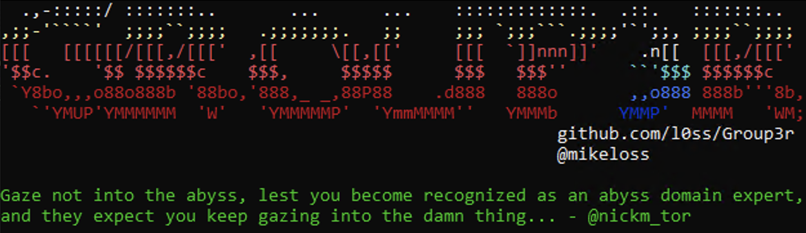

# VERY BETA: IF YOU RUN THIS AND IT EATS YOUR DOG IT'S *STILL* NOT MY FAULT

by Mike Loss (@mikeloss)

with help from @LukeHealy, @Sh3r4, and @LegendOfLynkle

  

Development of Group3r was generously supported by my previous employer:
  

## OK BUT WTF IS IT DO?

Like its ancestors, Group3r is a tool for pentesters and red teamers to rapidly enumerate relevant settings in AD Group Policy, and to identify exploitable misconfigurations in same. It does this by talking LDAP to Domain Controllers, parsing GPO config files off the domain SYSVOL share, and also by looking at other files (usually on file shares) that are referenced within GPOs, like scripts, MSI packages, exes, etc.

It might also be useful for other people doing other stuff, but it is explicitly NOT meant to be an audit tool. If you want to check your policy configs against some particular standard, you probably want Microsoft's Security and Compliance Toolkit, not Group3r.

I'll say it again extra clear: Group3r is *even more* focused on being useful for attackers and *even less* of an audit tool than previous iterations.

## Y U MAKE IT???

A lot of offensive tradecraft around Group Policy has historically focused on two main things: finding passwords (in GPP passwords etc), and abusing weak ACLs to modify GPOs. This stuff is super useful, but if you ignore the rest of Group Policy you're leaving a huge amount of really useful information on the table, never mind some really fun attack paths.

## Y U MAKE IT AGAIN???

Group3r is a page-1 rewrite of Grouper2, which was in turn a page-1 rewrite of Grouper. 

Grouper(1) was written in PowerShell and had a lot of horrible limitations.

Grouper2 was written in C# by someone who didn't know how classes worked and accidentally reinvented them from first principles by shoving wads of JSON around the place. That someone may have been me.

Group3r was also written in C# but this time by someone who has learned a small number of things about programming (like what a class is) and that person may also be me.

If I've done it right, it should be a lot more useful, a lot friendlier, and a lot less brittle than Grouper2 was.

## Y U MAKE ME SCROLL THIS FAR FOR USAGE???

Because I'm a monster.

### Output options
`-s` to send results to stdout.

`-f group3r.log` to send results to a file.

If you don't choose either `-s` or `-f` it will not run at all.

### Targeting specific domains/users

Ideally, run it on a domain joined machine as a domain user.

If you want, you can use it with `runas /netonly` on a non-domain-joined computer, but you'll need to (at least) tell it where to find a DC with `-c $dcIpAddress`, and you'll probably also want to tell it what domain to enumerate with `-d domain.tld`. If you do this but don't have your machine's DNS pointed at a DC or some other appropriate DNS server for the environment, a bunch of the checks probably won't work properly. Don't say I didn't warn you.

`-u domain\user` will make Group3r try to perform file permission checks as though it was running as that user. Should also accept group names in the same format.

### Limiting output

`-w` will limit output to only show settings with an associated 'finding', i.e. something significant enough that I wrote code to go looking for it.

`-a 4` will limit output to only the highest severity findings. You could probably also use some smaller numbers too I guess. Like 1, or 3. Probably not 0, that would be weird. 2 would be fine.

`-e` will only display GPOs, policy types, and settings that are enabled. For example, if a GPO has 'Computer' policy disabled, this will not display any of those policy settings. WARNING: even disabled settings can have creds or other goodies in them. By using this option you will possibly miss them.

`-r` will not display any settings found in "morphed" files/folders. These files/folders are created when file replication between DCs fails, and can often provide an interesting/useful insight into how things were configured at some point in the past. They also often contain old GPP passwords, even in orgs that think they have cleaned up all their GPP passwords.

### Offline Mode

Like Grouper2, if you have an offline copy of SYSVOL you can have Group3r run against that in a limited fashion by running it with `-o -y $pathToSysvol`.

## HOW DO I READ THE OUTPUT???

OK here's an example:

The bit highlighted in red is a Group Policy Object (GPO). The top bar of that section tells you it's a GPO, the display name of the GPO (`testgpo123`), the unique identifier of the GPO (the bit in braces), and whether the GPO is current or "Morphed". Under that you've got some basic info on the GPO itself, including which OUs (if any) it's linked to.

The bit highlighted in magenta is a setting. The indent and little ASCII "tail" off the side of the block is meant to make it easier to see that it's associated with the GPO above. The top bar tells you that it's a setting, and what type of setting it is. In this instance it's an MSI package being pushed to computers to install PuTTY.

The bit highlighted in green is a finding. The colour (`Red` in this instance) in the top bar is the triage level, using the same levels as Snaffler - Green, Yellow, Red, and Black. Below that it's got a reason that a finding was raised, and some detail about this specific misconfiguration and maybe some abuse guidance if I was feeling nice when I wrote it.

Here's another example of a setting with a finding:

This one is morphed, which means it might not be current, but it would have been applied at some point in the past. In this instance we can see that a finding has been raised because Domain Users is being added to BUILTIN\Administrators on the target computers.

Here's yet another example, this time of a Startup Script setting:

This setting isn't morphed, and has two findings - one because the arguments for the script look like a hard-coded password, and one because Group3r has spotted that the script in question is modifiable by the current user, which should allow for some very entertaining shenanigans if you put something saucy in the script.

You get the idea.

## WHAT HAPPENED TO PRETTY MODE???

It was a fucken nightmare to write the first time and I have less than half as much free time now as I did back then.

Also it used to truncate data all the time.
